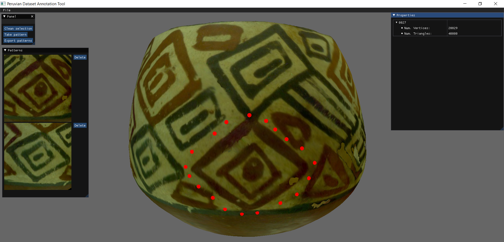

# Sample Pattern Selection Tool

This repository contains the source code for the sample pattern selection tool presented in the paper:

> S. Lengauer, I. Sipiran, R. Preiner, T. Schreck, B. Bustos: A Benchmark Dataset for Repetitive Pattern Recognition on Textured 3D Surfaces. Computer Graphics Forum, 40(5), Proc. Eurographics Symposium on Geometry Processing. 2021.

## Source code

The tool was developed and tested in Visual Studio 2019. This repository contains the complete source code and the binary dependencies already compiled in VS 2019. 

## Execution

Once the program is built. Copy the files from this [link](https://drive.google.com/file/d/1Ju8prvp6UM_1ZpIo1JWWqMJh_xym0vVO/view?usp=sharing) in the same folder where the executable is located. This zip contains the shaders, basic shapes, and precompiled dlls to execute the program. In this zip, there is also one OBJ file as example for the annotation.

## Screenshot
